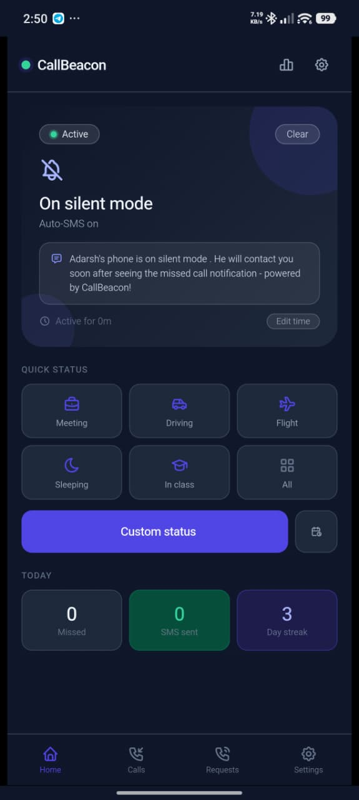
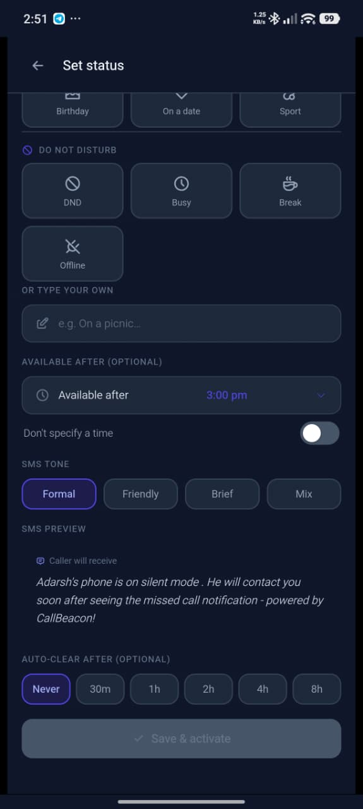
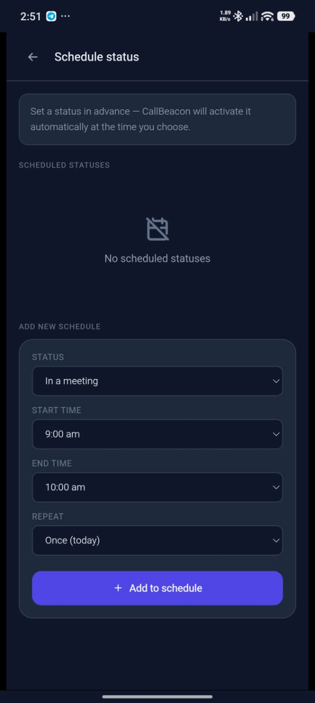
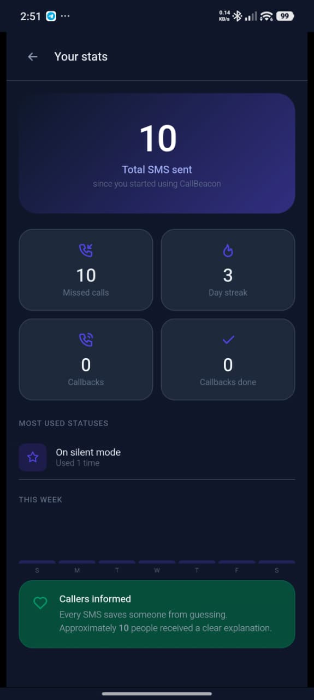
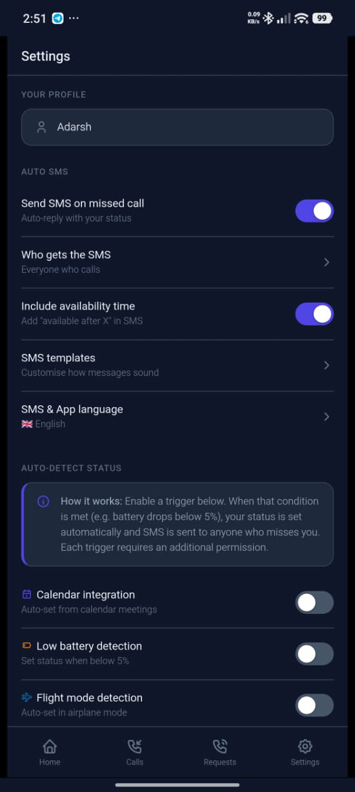
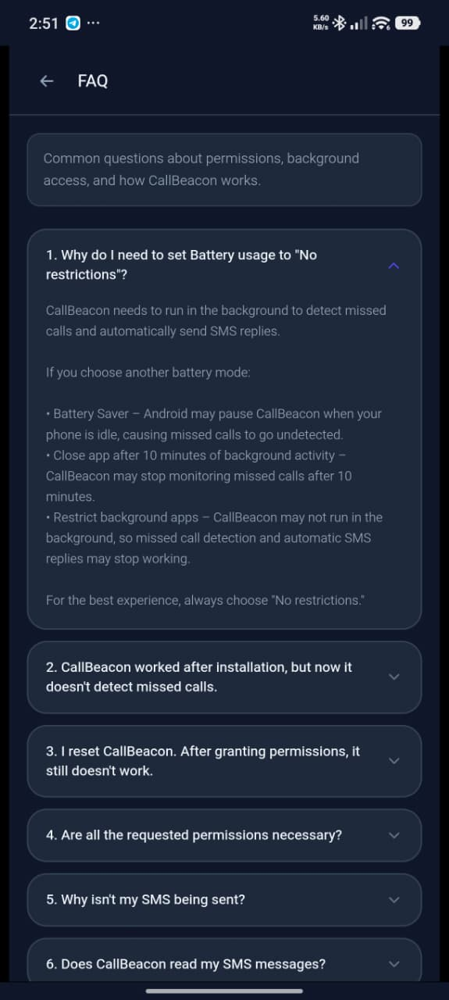

# 📞 CallBeacon

> **Never leave a missed call unanswered.**

CallBeacon is a native Android application that automatically sends personalized SMS replies whenever you miss a call. Whether you're driving, in a meeting, studying, sleeping, or your phone is on silent, CallBeacon lets callers know why you couldn't answer—reducing unnecessary worry and improving communication.

> **Note:** This repository contains the official website and supporting resources for CallBeacon. The Android application source code is intentionally kept private as CallBeacon is an actively maintained standalone product.

---

## 🌐 Live Website

🔗 **Website:** https://callbeacon.onrender.com

---

## 📸 Screenshots

<table>
<tr>
<td align="center">
<b>🏠 Home Page</b><br><br>

</td>

<td align="center">
<b>📋 Set Status</b><br><br>

</td>
</tr>

<tr>
<td align="center">
<b>📅 Schedule Status</b><br><br>

</td>

<td align="center">
<b>📊 Activity Screen</b><br><br>

</td>
</tr>

<tr>
<td align="center">
<b>⚙️ Settings</b><br><br>

</td>

<td align="center">
<b>❓ FAQ Section</b><br><br>

</td>
</tr>
</table>

---

## 📱 About CallBeacon

CallBeacon is a privacy-focused Android application that automatically detects missed calls and sends customizable SMS replies using your device's SIM card.

Unlike cloud-based services, **CallBeacon works entirely on your device.** No internet connection is required to send replies, and no missed call or SMS content is uploaded to any server.

---

## ✨ Features

- 🔒 Privacy-focused architecture
- 📞 Automatic missed call detection
- 💬 Personalized SMS auto-replies
- 📝 Unlimited custom message templates
- 📅 Schedule-based automation
- 👥 Contact-specific reply rules
- 📲 SMS sent using the device's SIM card
- 📶 Works completely offline
- 🔔 SMS delivery notifications
- 💾 Backup & Restore
- ❓ Built-in FAQ & Help section
- 🎨 Modern Material Design interface

---

## 🚀 How It Works

1. User receives a phone call.
2. The call goes unanswered.
3. CallBeacon detects the missed call in the background.
4. The app checks the configured reply settings.
5. A personalized SMS is automatically sent.
6. The caller immediately knows why the call wasn't answered.

---

## 📥 Download

Download the latest **official digitally signed APK** from the official website.

➡️ **https://callbeacon.onrender.com**

---

## 📸 Website Includes

- Landing Page
- Feature Showcase
- App Screenshots
- Installation Guide
- Frequently Asked Questions (FAQ)
- Privacy Policy
- Terms & Conditions
- APK Download
- Contact Information
- Responsive Design

---

## 🛠 Tech Stack

### Android

- Java
- Android SDK
- XML
- SQLite
- Android Background Services
- SMS Manager API
- Call Log API
- Notification API

### Website

- HTML5
- CSS3
- JavaScript

---

## 📚 Technical Documentation

The documentation includes:

- Project Overview
- System Architecture
- Application Workflow
- Android Permissions
- Design Decisions
- Folder Structure
- Security & Privacy
- Challenges Faced
- Future Improvements

📄 **Technical Documentation:** `docs/CALLBEACON_TECHNICAL_DOCUMENTATION.md`

---

## 🔒 Source Code

The Android application source code is intentionally kept private because **CallBeacon is an actively maintained standalone product.**

This repository contains:

- Official Website
- Website Source Code
- APK Distribution
- Technical Documentation
- Privacy Policy
- Terms & Conditions
- FAQ
- Screenshots

---

## 🔐 Security & Privacy

-  Digitally signed APK
-  Offline processing
-  No cloud storage
-  No user account required
-  No missed call or SMS content is uploaded to any server

For additional transparency, users can verify the APK using **VirusTotal** before installation.

---

## 📂 Repository Structure

```text
.
├── assets/
├── screenshots/
├── downloads/
│   └── CallBeacon.apk
├── docs/
│   └── CALLBEACON_TECHNICAL_DOCUMENTATION.md
├── index.html
├── privacy.html
├── terms.html
├── README.md
```

---

## 📄 License

This repository contains the official website and supporting resources for CallBeacon.

The Android application and its proprietary source code remain the intellectual property of the author.

---

## 👨‍💻 Developer

**Adarsh Singh**

- GitHub: <https://github.com/Adarsh0414>

---

<div align="center">

# 📞 CallBeacon

### *A missed call shouldn't leave someone wondering.*

</div>